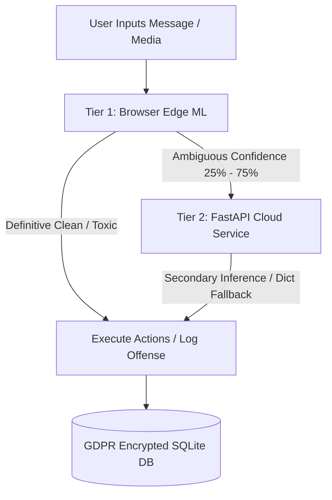

# SafeTalk AI — Hybrid Edge-Cloud Moderation Console

SafeTalk AI is a production-grade, two-tier hybrid content moderation system. It integrates client-side Web ML (TensorFlow.js, NSFWJS, Tesseract OCR, Web Audio API) with a Python FastAPI cloud service and an encrypted SQLite storage layer to deliver real-time, privacy-preserving moderation.

The system is designed with a **Privacy-by-Design** approach (GDPR compliant) and optimizes the balance between edge computing latency and cloud inference accuracy.

---

## 🚀 Key Highlights & Architecture

SafeTalk AI uses a **two-tier cascading moderation pipeline** common in high-scale social platforms (e.g., Instagram, TikTok):

1. **Tier 1 (Edge Filtering):** Obvious clean or toxic content is parsed directly in the browser using Web ML models. This eliminates API latency and saves cloud computing costs.
2. **Tier 2 (Cloud Fallback):** Ambiguous content (confidence scores between 25% and 75%) is automatically escalated to the FastAPI cloud service for high-fidelity moderation.



---

## 🛠️ Features

### 1. Edge-Side Multi-Modal Moderation (Tier 1)
* **Text Analysis:** TensorFlow.js Toxicity model categorizes text insults, threats, identity hate, etc.
* **Transliteration Preprocessor:** Resolves English typos/evasions (*fck, b1tch*) and transliterated Tamil slang (*loosu, naaye, panni*) to standard English. Supports native Tamil script matching.
* **Acoustic Shouting Detector:** Analyzes microphone streams via the Web Audio API. Computes the **Root Mean Square (RMS)** amplitude in real-time, flagging aggressive yelling independent of the words spoken.
* **Video Frame Moderation:** Captures video frame snapshots and runs them through **NSFWJS** to detect inappropriate content, and **Tesseract OCR** to extract and moderate text overlays.

### 2. Cloud Fallback & Secure Storage (Tier 2)
* **Cascaded Inference REST APIs:** Built using **FastAPI** to verify ambiguous edge classifications.
* **GDPR Privacy-by-Design:** Raw offense logs and whitelists are encrypted at rest using **AES-256 (Fernet symmetric key cryptography)**. Message text is never stored in plaintext.
* **Self-Healing State Machine:** SQLite database stores user ban states (suspends users on the 3rd offense) and blocking relations. The database automatically clears expired bans on-the-fly during user state queries.

### 3. Premium Interactive UX
* **Glassmorphic Design:** Styled with a modern translucent Light/Dark mode UI.
* **Interactive Simulator:** Switch between User A and User B columns with pre-configured mock triggers for easy recruiter demonstrations.

---

## 💻 Tech Stack

| Layer | Technologies |
| :--- | :--- |
| **Frontend** | Vanilla JavaScript, HTML5, CSS Variables, Tailwind/Custom Glassmorphism |
| **Edge ML** | TensorFlow.js, NSFWJS (MobileNetV2), Tesseract OCR |
| **Backend** | Python, FastAPI, Uvicorn, SQLite |
| **Security** | Cryptography (Fernet AES-256 symmetric encryption) |

---

## ⚡ Setup & Run Locally

### 1. Run the Frontend
Since the frontend consists of static assets, you can run it directly:
* Double-click `index.html` to open it in your browser, or
* Run a local static server (e.g., Live Server extension in VS Code).

### 2. Run the Backend API
The backend requires Python 3.8+:

```bash
# Navigate to the server folder
cd server

# Install dependencies
pip install -r requirements.txt

# Start the FastAPI server locally
python app.py
```
*The server will spin up on `http://127.0.0.1:8000`.*
*To point the frontend to your local server, open [script.js](script.js) and uncomment the localhost configuration line in the **Server connection settings**.*

---

## 🛡️ Recruiter Cheat-Sheet: Engineering Trade-offs

If you are reviewing this project for a **Software Engineering**, **AI/ML**, or **MLOps** role, here are the core decisions implemented:

* **Edge vs. Cloud Latency:** Edge models run on CPU/WebGL in ~15ms, eliminating the round-trip API call for 90% of messages. Cloud resources are only consumed when edge predictions are uncertain.
* **GDPR & PII Compliance:** Chat applications typically log offenses for audit. Plaintext logs are a major liability. By encrypting log entries with AES-256 on-the-fly, even if the database file (`safetalk.db`) is leaked, user conversations remain fully secure.
* **ML Model Fallbacks:** Heavy transformer models (`toxic-bert`) take up ~400MB of RAM, which exceeds the memory limits of free cloud tiers (like Render's 512MB RAM). SafeTalk AI handles this gracefully by detecting memory/import limitations and falling back to a custom, zero-overhead regex dictionary classifier, keeping the service 100% online.
